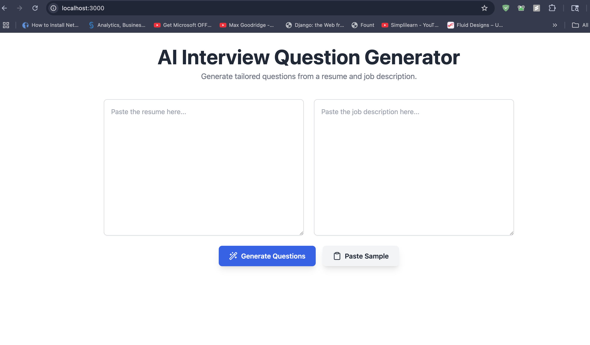
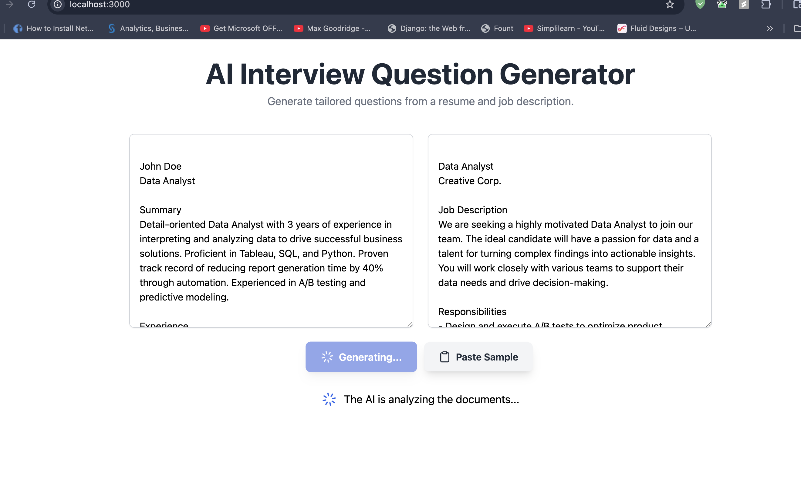
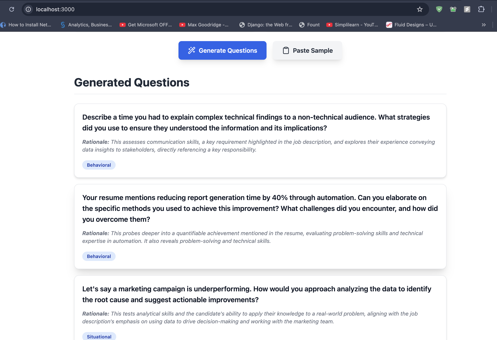

# AI Powered Interview Question Generator

> An intelligent tool that leverages generative AI to create tailored, insightful interview questions based on a candidate's resume and a specific job description.

---

## 🚀 Inspiration

In today's competitive job market, conducting effective interviews is more critical than ever. Hiring managers and recruiters often struggle to move beyond generic questions and truly probe a candidate's specific skills and experience in the context of the role they're hiring for.

We were inspired to solve this problem by bridging the gap between a candidate's resume and a job's requirements. Our goal was to create a tool that empowers interviewers to ask more relevant, insightful, and targeted questions, leading to better hiring decisions. We wanted to automate the "homework" an interviewer has to do, saving them time and elevating the quality of the interview for everyone involved.

## ✨ What it does

The AI Interview Question Generator is a web application with a simple and intuitive interface. Here's the user flow:

1.  **Input:** The user pastes the full text of a candidate's resume into one text area and the corresponding job description into another.
2.  **Analyze & Generate:** Upon clicking "Generate Questions," the application sends both documents to a backend service.
3.  **AI-Powered Logic:** The backend uses the Google Gemini API to analyze the two texts. It identifies overlaps in skills, potential gaps in experience, and key accomplishments listed on the resume that are relevant to the job description.
4.  **Output:** The AI generates a curated list of 5-7 high-quality interview questions. Each question is categorized as **Technical**, **Behavioral**, or **Situational** and includes a "Rationale" explaining *why* it's a good question to ask that specific candidate for that specific role.
5.  **Sample Data:** For a quick demonstration, users can click the "Paste Sample" button to populate the form with a pre-written sample resume and job description.

This process ensures that every interview is tailored, data-driven, and focused on what truly matters.

## Screenshots







## 🛠️ How we built it

This project was built on a modern, full-stack TypeScript foundation, leveraging the **Modelence** framework to rapidly develop a robust application.

* **Backend:**
    * **Framework:** Modelence
    * **Database:** MongoDB (managed via Modelence Stores)
    * **AI Integration:** Google Gemini Pro API (`gemini-1.5-flash-latest`) for the core question-generation logic.
    * **API Layer:** Modelence Modules, Queries, and Mutations for a type-safe API.
    * **Environment:** Node.js
* **Frontend:**
    * **Framework:** React
    * **Data Fetching & State Management:** TanStack Query (`useQuery`, `useMutation`) for seamless communication with the Modelence backend.
    * **Routing:** React Router
    * **Styling:** Tailwind CSS for a clean, responsive UI.
* **Architecture:** The entire application follows the Modelence pattern of organizing code into domain-specific modules (`question-generator`), each containing its own database schema (`db.ts`), API logic (`index.ts`), and frontend components.

---

## 🏁 Getting Started

To run this project locally, follow these steps:

1.  **Prerequisites:**
    * Node.js (v18+)
    * npm or yarn
    * Git

2.  **Clone the repository:**
    ```bash
    git clone <your-repository-url>
    cd <project-directory>
    ```

3.  **Install dependencies:**
    ```bash
    npm install
    ```

4.  **Set up environment variables:**
    * Create a file named `.env` in the root of the project.
    * Add your Google Gemini API key:
        ```env
     
        GEMINI_API_KEY="your_gemini_api_key"
        ```

5.  **Run the development server:**
    ```bash
    npm run dev
    ```

6.  **Open the application:**
    * Navigate to `http://localhost:3000` in your web browser.
